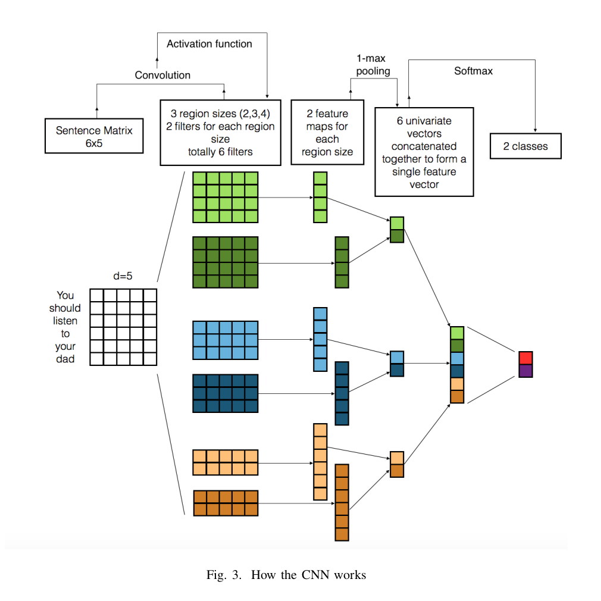

<div style="text-align:center;font-size:30px">﷽</div>


<div style="text-align:center"><h1>NLP with Spark</h1></div>
<div style="text-align:center"><h2>Sentiment analysis in comments</h2></div>


Work done by  **CHEBBAH Mehdi** and **HAMMAS Ali Cherif**


<h1>Table of contents</h1>

[TOC]

<div class="page-break"></div>

# What is NLP?

NLP (*Natural Language Processing*) is a **branch of artificial intelligence** which deals particularly with the processing of written language also called with the French name TALN (Traitement automatique du langage naturel) or TLN. In short, it is everything related to human language and its processing by automated tools.

The NLP can be divided into 2 main parts, the **NLU** (*Natural Language Understanding*) and the **NLG** (*Natural Language Generation*).

- The first concerns the "comprehension" part of the text, taking a text as input and being able to extract data from it. This type is widely used in:

   - Email spam filters.
   - The collection of user reviews for a product.
   - Chat-bots.
   - Product recommendations in E-commerce.
   - etc

-  The second, is to generate text from the data, to be able to build coherent sentences automatically. This type is widely used in:

   - Machine translation.
   - Chat-bots.
   - Applications such as *Siri* or *Google Assistent*.
   - Automatic generation of financial reports.
   - etc


# Data pre-processing in NLP

## Theoretically: 

There are several data sources that can be used in the NLP process, for example **Web scraping**, **Social networks**, **Databases**, **Real time data (Streaming)**, ...etc...

And depending on the source of the data (so its quality) we do the pre-processing. But globally there are 3 phases:

+ **Processing missing values**: This is a very important phase in the preparation of data for all types of models (NLP or other). There are several approaches to solve the problem of missing values without deleting them (because the deletion of these values can bias the model)
+ **Annotate the data**: This phase is usually done using human intelligence (several humans read the data and classify it according to predefined classes), or using unsupervised (or semi-supervised) Machine Learning algorithms to do the annotation.
+ **Data cleansing**: This phase depends on the data sources and data quality and also on the objective of the analysis. We can (as we can't) find the following treatments:
   + **Eliminate HTML tags**: (for scrapped data)
   + **Delete additional white spaces** (Remove noise)
   + **Convert all characters to lowercase** **Convert all characters to lowercase
   + **Deleting empty words**: (depends on language) *for example: for, a, on, de, in, ...*
   + **Delete punctuation**
   + **lemmatization**: transformation of each word to its base form *for example (done => to do), ...)*.
   + **Tokenization**: cutting documents (texts) into smaller pieces called tokens.
   + **TF-IDF**: (*term frequency-inverse document frequency*) is a statistical measure used to evaluate the importance of a term contained in a document, relative to a collection. The weight increases in proportion to the number of occurrences of the word in the document. It also varies according to the frequency of the word in the collection.

## In Practice

First, we will create a Spark session.

```python
import findspark
findspark.init('/opt/spark')

from pyspark import SparkContext
sc = SparkContext("local", "NLP App")
```

We used `findspark` to initialize a `Spark` environment in the `conda` environment. Then initialize a `SparkContext`.

Now we can import the data-sets

```python
dataset_path = '/path/to/datasets/files/folder/'
stopwords_path = '/path/to/stopwords/file/folder/'
data = sc.textFile(dataset_path + "*.txt").map(lambda line: line.split("\t"))
stopwords = sc.textFile(stopwords_path + "english").collect()
```

Then we prepare the data for pre-processing (we separate the documents from the annotations).

```python
documents = data.map(lambda line: line[0])
labels = data.map(lambda line: line[1])
```

1. The pre-processing of the data follows the following scheme:

   1.  Convert documents to lowercase.

   2.  Remove punctuation.

   3.  Remove additional white space.

   4.  Tokenization (in words).

   ```python
   def lower_clean_str(x):
     punc='!"#$%&\'()*+,-./:;<=>?@[\\]^_`{|}~'
     lowercased_str = x.lower()
     for ch in punc:
       lowercased_str = lowercased_str.replace(ch, ' ')
     return lowercased_str.strip()
   
   import re
   documents = documents.map(lambda line: re.sub(" +", ' ', lower_clean_str(line)).split(" "))
   ```

2. Delete empty words.

   ```python
   def removeStopWords(words, stopwords):
       return [x for x in words if x not in stopwords]
   
   documents = documents.map(lambda line: removeStopWords(line, stopwords))
   documents.take(2)
   # Resultats:
   # [['slow','moving','aimless','movie','distressed','drifting','young','man'],
   # ['sure','lost','flat','characters','audience','nearly','half','walked']]
   ```

3. Apply TF-IDF

   ```python
   from pyspark.mllib.feature import HashingTF, IDF
   hashingTF = HashingTF()
   tf = hashingTF.transform(documents)
   
   tf.cache()
   idf = IDF().fit(tf)
   tfidf = idf.transform(tf)
   
   idfIgnore = IDF(minDocFreq=2).fit(tf)
   tfidfIgnore = idfIgnore.transform(tf)
   ```

4. Prepare the required data structures for the creation of the model: for the *training* phase the model takes as *input* the structure `RDD of LabeledPoints`.

```python
from pyspark.mllib.regression import LabeledPoint
tfidfWithIndexes = tfidfIgnore.zipWithIndex().map(lambda x: (x[1], x[0]))
labelsWithIndexes = labels.zipWithIndex().map(lambda x: (x[1], x[0]))
labelsWithIndexes.take(5)
trainingData = tfidfWithIndexes.join(labelsWithIndexes).map(lambda x: LabeledPoint(x[1][1], x[1][0]))
training, test = trainingData.randomSplit([0.7, 0.3])
```


# NLP analysis types

There are two main categories of NLP (depending on the analysis algorithm):

>  ##### Note:
>
>  In this work we will (practically) use a statistical model based on supervised algorithms. However, the methods of Deep Learning are only explained theoretically.  


## Machine Learning based (statistics)

This category of algorithms is the most used because of its simplicity, we can find two approaches used for different objectives:

### Supervised methods

Requires the data set to be annotated. These methods are used for sentiment analysis, extraction of information from data, text classification, etc... The most commonly used algorithms are:

* *Support Vector Machines (SVM)*
* *Naïve Bayes*
+ *Conditional Random Field (CRF)*.
+ *Bayesian Networks* 
+ ... etc

### Unsupervised methods

Does not require annotation of the data-sets. And they are used for morphology, sentence segmentation, text classification, lexical disambiguation, translation, ...etc. 


## Deep Learning based

Recently, Deep Learning has become one of the most used methods to solve complex learning problems since it allows not only to extend the limits of the models previously seen (statistical models) but also to give sometimes excellent results depending on the context in which it is used.

Although there is a lot of established researches so far, there are two approaches that are widely used for NLP (`CNN` and `RNNN`).

### `CNN`

The **`CNN`** ( *Convolutional Neural Network*) is a type of artificial neural network (`ANN`) which as its name implies is a set of neurons (representing weights) that are classified in `layers`. The main difference between the `CNN` and `ANN` is that unlike the `ANN` which relies on activation functions to move from one layer to another, the `CNN` applies filters to the input data to extract features.


The idea of this approach consists first of all in cutting the sentences into words which are then transformed into a matrix of word integrations (the input matrix) of dimension d, then just after the input matrix is cut into several regions so that the different filters are then applied to the corresponding matrices, then a crucial step called "pooling" must be launched, which consists in carrying out transformations on the resulting matrices to be equal to a predefined size. There are two main reasons for this process: 

1. To give a fixed size to the output matrix
2. Reduce the size of the output matrix 

whatever the size of the input matrix. At the end we will have the representation of the final phase which represents a classifier based on the extracted features.



In general, **CNNs** are efficient because they can extract semantic clues when it comes to the global context, but they have difficulty preserving sequential order and modeling long distance contextual information. Recurrent models are better suited for this type of learning and are discussed below.

### `RNN`

**`RNNs`** (Recurrent Neuron Networks) are neural networks that are specifically designed to perform very well when it comes to sequenced data and this gives them a very big advantage for NLP. RNNs are very good at processing sequenced data since they are based on a concept called Sequential Memory, which consists of learning things based on a mechanism that we humans use a lot in our lives, this is one of the most efficient methods to model it.

So if we ask someone to recite the alphabets in normal order.

` A B C D E F G H I J K L M N O P Q R S T U V W X Y Z `

He won't have any difficulty to do it but if we give him an alphabet in the middle and we ask him to complete the sequence he will have some difficulties but right after he will be able to recite them very quickly and this since this person had learned the alphabets in sequence.

A more difficult challenge is to recite the alphabet in reverse order.  

` Z Y X W V U T S R Q P O N M L K J I H G F E D C B A `

it becomes even more difficult even if everyone knows the alphabets, just the fact that the sequencing is not respected makes the task difficult and even sometimes impossible, the same thing is applied for `RNNs`.

To be able to include this concept in these neural networks it is enough to take a simple `ANN`, then in each layer an arc is created that allows to connect the output to the input, this way the data of the previous state will be added to the data of the current state.


Therefore, the main advantage of the Recurrent Neural Network is the possibility of giving a meaning to the word sequences in order to know precisely the subject and the context of that sentence, the best example where this model can be applied is a chat-bot because it allows to easily understand what the user wants through the sentence he has expressed in the input and afterwards the model will be able to define the best and most suitable answer in relation to what has been asked for.


# Building and testing the models

We will build 3 models

+ The first is naive bayes

```python
from pyspark.mllib.classification import NaiveBayes
model1 = NaiveBayes.train(training, 5.0)
# le 2eme parametre c'est le parametre de lissage=5.0
predictionAndLabel_NB = test.map(lambda p: (model1.predict(p.features), p.label))
```

+  The second is SVM

```python
from pyspark.mllib.classification import SVMWithSGD
model2 = SVMWithSGD.train(training, iterations=100)
predictionAndLabel_SVM = test.map(lambda p: (model2.predict(p.features), p.label))
```

+  The third is RF

```python
from pyspark.mllib.tree import RandomForest
model = RandomForest.trainClassifier(training, numClasses=2, numTrees=5, categoricalFeaturesInfo={}, featureSubsetStrategy="auto", maxDepth=4, maxBins=32)
predictions = model.predict(test.map(lambda x: x.features))
predictionAndLabel_RF = test.map(lambda lp: lp.label).zip(predictions)
```

>  ##### Note:
>
>  The parameters used in the creation of the models are chosen in such a way that **the accuracy** of the models is the best possible.


# Comparison between models

We can compare **the accuracy** of the models as follows

```python
def accuracy(predictionAndLabel):
    return 1.0 * predictionAndLabel.filter(lambda pl: pl[0] == pl[1]).count() / test.count()

# NB
print('model accuracy {}'.format(accuracy(predictionAndLabel_NB)))
# Resultats: model accuracy 0.7817982456140351

# SVM
print('model accuracy {}'.format(accuracy(predictionAndLabel_SVM)))
# Resultats: model accuracy 0.7872807017543859

# RF
print('model accuracy {}'.format(accuracy(predictionAndLabel_RF)))
# Resultats: model accuracy 0.4868421052631579
```

We can clearly see that the most suitable models for natural language processing are **Naïve Bayes** and **SVM** with an accuracy of **78%**.


# Usefulness of Spark

The use of Spark has made a big difference in terms of: 

+ **Time**: The data structures offered by Spark (`RDD`) are easily shared on threads in the computer (or the `cluster` if used in a network) which speeds up the work.
+ **Re-usability**: The code used in a single computer (development mode) is the same code used in the cluster (production mode).
+ **Ease of use**: Spark offers rich `API` data structures, Machine Learning and model performance calculation algorithms, powerful data mining methods.
